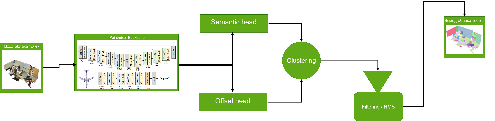
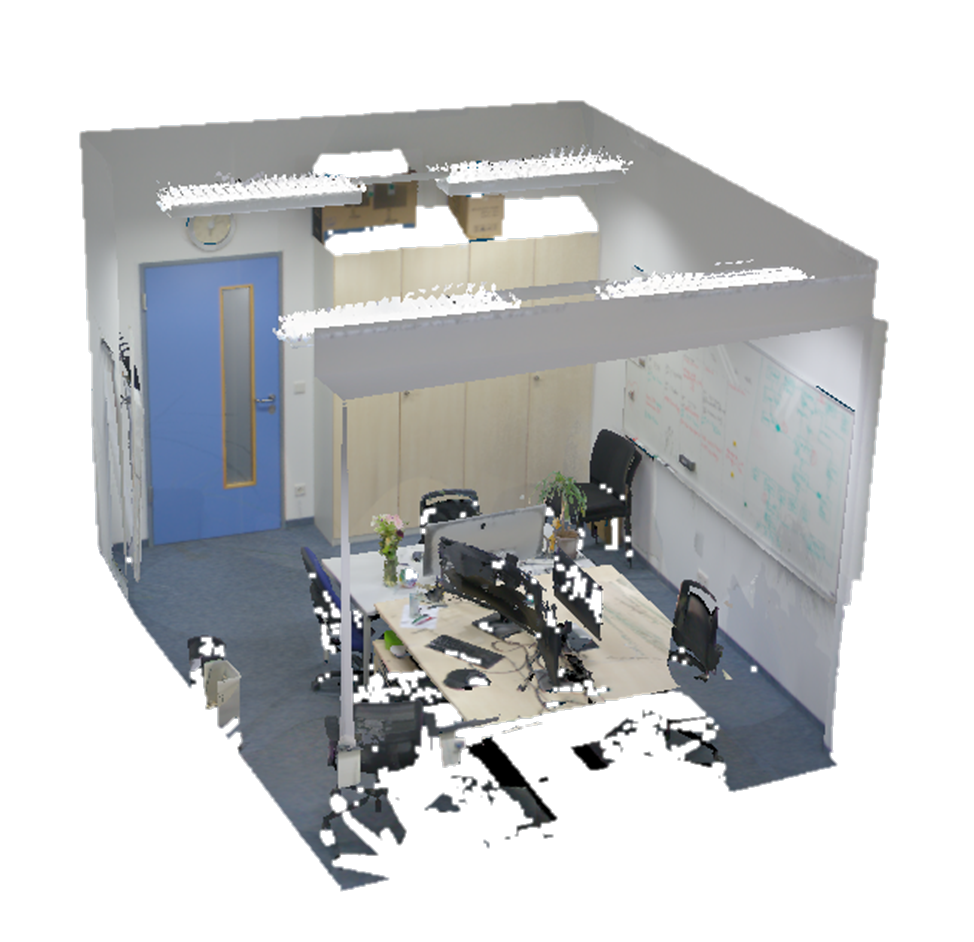
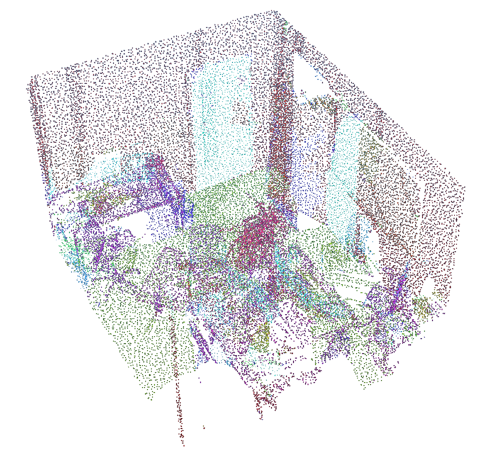
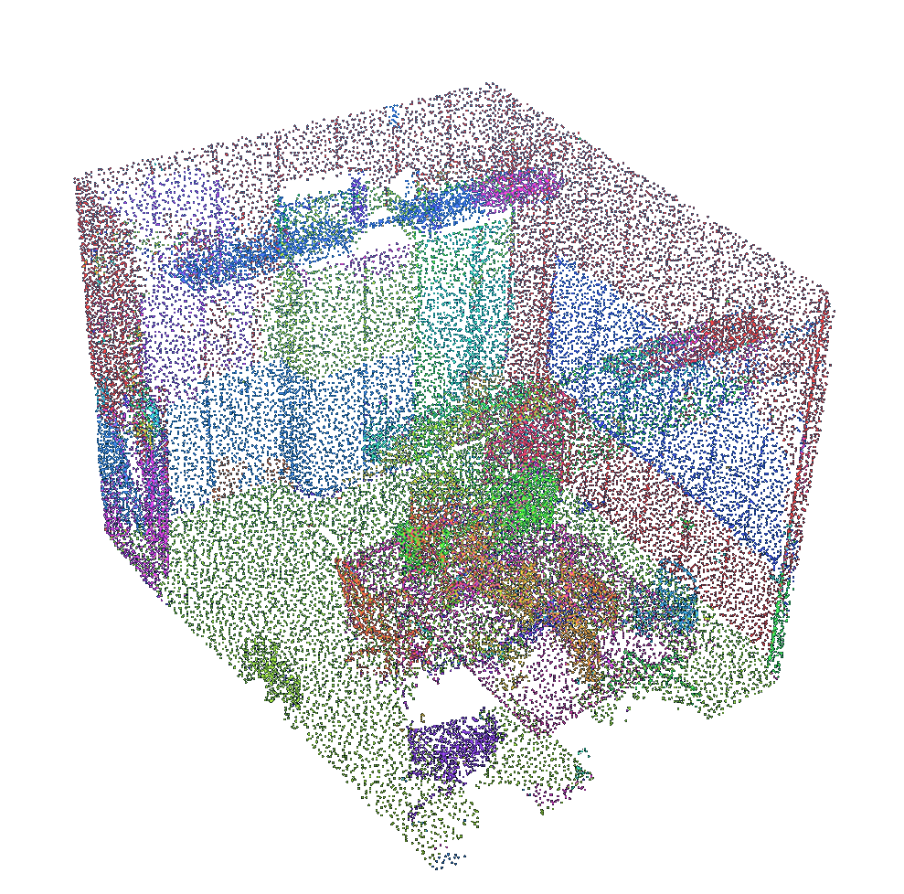

# PointMixer ScanNet++ Semantic и Panoptic

Репозиторий содержит адаптацию PointMixer для ScanNet++: подготовку датасета, обучение semantic segmentation, обучение panoptic segmentation и инференс по одной сцене с сохранением цветного PLY, NumPy-массивов, CSV и Excel-отчетов.

Основа проекта - официальный PointMixer ECCV 2022. В этой версии добавлены загрузчики ScanNet++, panoptic-разметка, semantic/focal/lovasz loss, class-balanced crops, отчеты по классам и Windows/Docker-скрипты для RTX 3060.

## Схема



Облако точек подается в PointMixer backbone. Backbone строит признаки точек через MLP/Mixer-блоки и иерархические down/up переходы. Semantic head предсказывает класс каждой точки. Для panoptic-режима offset head дополнительно предсказывает смещение точки к центру объекта. После этого точки группируются по `xyz + offset`, мелкие/сомнительные группы фильтруются, а пересекающиеся instance-кластеры проходят NMS.

## Примеры

Чистая сцена:



Semantic-разметка:



Panoptic-разметка:



## Структура путей

Основные пути внутри Docker:

```text
/code/ECCV22-PointMixer/sem_seg              код проекта внутри контейнера
/datasets                                    датасеты, смонтированы из E:\datasets
/workspace/outputs                           результаты, смонтированы в E:\pointmixer_outputs
```

Основные ScanNet++ датасеты после подготовки:

```text
/datasets/pointmixer_scannetpp_top100_rgb_pv004                 semantic, prevoxel 0.04
/datasets/pointmixer_scannetpp_top100_panoptic_rgb_pv004        panoptic, prevoxel 0.04
```

## Docker

Проверка GPU в Docker:

```powershell
docker run --rm --gpus all nvidia/cuda:11.8.0-base-ubuntu22.04 nvidia-smi
```

Создание контейнера:

```powershell
docker pull jaesungchoe/pointmixer:cuda11.1; New-Item -ItemType Directory -Force E:\pointmixer_outputs | Out-Null; docker run -it --gpus all --name pointmixer-scannetpp --shm-size 12G -v C:\Users\vladi\ECCV22-PointMixer-main:/code/ECCV22-PointMixer -v E:\datasets:/datasets -v E:\pointmixer_outputs:/workspace/outputs jaesungchoe/pointmixer:cuda11.1
```

Запуск уже созданного контейнера:

```powershell
docker start -ai pointmixer-scannetpp
```

Выполнить команду внутри контейнера без входа в shell:

```powershell
docker exec -it pointmixer-scannetpp bash -lc "cd /code/ECCV22-PointMixer/sem_seg && pwd"
```

## Подготовка ScanNet++

Semantic-датасет для обычной классификации точек:

```powershell
docker exec -it pointmixer-scannetpp bash -lc "cd /code/ECCV22-PointMixer/sem_seg && python tools/prepare_scannetpp.py --input-root /datasets/scannetpp_full/data --output-root /datasets/pointmixer_scannetpp_top100_rgb_pv004 --label-source benchmark --prevoxel-size 0.04"
```

Panoptic-датасет с semantic labels, instance ids и offset-целями:

```powershell
docker exec -it pointmixer-scannetpp bash -lc "cd /code/ECCV22-PointMixer/sem_seg && python tools/prepare_scannetpp_panoptic.py --input-root /datasets/scannetpp_full/data --output-root /datasets/pointmixer_scannetpp_top100_panoptic_rgb_pv004 --label-source benchmark --prevoxel-size 0.04"
```

Для ScanNet++ используются benchmark-классы top100. Классы `wall`, `floor`, `ceiling` остаются semantic-классами, но не считаются thing-instance объектами для offset/panoptic.

## Обучение semantic segmentation

Команда для RTX 3060 12 GB:

```powershell
docker exec -it pointmixer-scannetpp bash -lc "cd /code/ECCV22-PointMixer/sem_seg && SCANNETPP_ROOT=/datasets/pointmixer_scannetpp_top100_rgb_pv004 SAVEROOT=/workspace/outputs/PointMixerScanNetPP_semantic_rgb_pv004 EPOCHS=20 LOOP=10 LR=0.02 VOX_SIZE=0 TRAIN_VOXEL_MAX=16000 EVAL_VOXEL_MAX=50000 WORKERS=1 bash script/run_scannetpp_PointMixer_3060.sh"
```

Результаты обучения сохраняются в:

```text
E:\pointmixer_outputs\PointMixerScanNetPP_semantic_rgb_pv004
```

## Обучение panoptic segmentation

Базовый panoptic запуск с focal/lovasz semantic loss:

```powershell
docker exec -it pointmixer-scannetpp bash -lc "cd /code/ECCV22-PointMixer/sem_seg && SCANNETPP_ROOT=/datasets/pointmixer_scannetpp_top100_panoptic_rgb_pv004 SAVEROOT=/workspace/outputs/PointMixerScanNetPP_panoptic_rgb_pv004_focal_lovasz EPOCHS=12 LOOP=12 LR=0.00005 OPTIM=AdamW VOX_SIZE=0 TRAIN_VOXEL_MAX=16000 EVAL_VOXEL_MAX=50000 WORKERS=1 BLOCK_SIZE=3.0 MIN_POINTS_IN_BLOCK=1024 MIN_TRAIN_POINTS=4096 CLASS_BALANCE_PROB=0.35 OFFSET_LOSS_WEIGHT=0 OFFSET_DIR_LOSS_WEIGHT=0 SEMANTIC_LOSS_TYPE=focal_lovasz FOCAL_GAMMA=1.5 FOCAL_LOSS_WEIGHT=1.0 LOVASZ_LOSS_WEIGHT=0.4 AUTO_CLASS_WEIGHTS=True CLASS_WEIGHT_POWER=0.5 CLASS_WEIGHT_MAX=5 bash script/run_scannetpp_PointMixerPanoptic_3060.sh"
```

Fine-tune от готового чекпоинта:

```powershell
docker exec -it pointmixer-scannetpp bash -lc "cd /code/ECCV22-PointMixer/sem_seg && SCANNETPP_ROOT=/datasets/pointmixer_scannetpp_top100_panoptic_rgb_pv004 SAVEROOT=/workspace/outputs/PointMixerScanNetPP_panoptic_rgb_pv004_finetune EPOCHS=12 LOOP=12 LR=0.00005 OPTIM=AdamW VOX_SIZE=0 TRAIN_VOXEL_MAX=16000 EVAL_VOXEL_MAX=50000 WORKERS=1 BLOCK_SIZE=3.0 MIN_POINTS_IN_BLOCK=1024 MIN_TRAIN_POINTS=4096 CLASS_BALANCE_PROB=0.35 OFFSET_LOSS_WEIGHT=0 OFFSET_DIR_LOSS_WEIGHT=0 SEMANTIC_LOSS_TYPE=focal_lovasz FOCAL_GAMMA=1.5 FOCAL_LOSS_WEIGHT=1.0 LOVASZ_LOSS_WEIGHT=0.4 AUTO_CLASS_WEIGHTS=True CLASS_WEIGHT_POWER=0.5 CLASS_WEIGHT_MAX=5 LOAD_MODEL=/workspace/outputs/PointMixerScanNetPP_panoptic_rgb_pv004_focal_lovasz_ep10_continue_to_miou020/2026-05-06_17-54-56__scannetpp__pointmixer_panoptic_3060/epoch=008--mIoU_val=0.1993--.ckpt bash script/run_scannetpp_PointMixerPanoptic_3060.sh"
```

Важные параметры:

- `TRAIN_VOXEL_MAX` - максимум точек в train crop.
- `EVAL_VOXEL_MAX` - максимум точек при validation/inference crop.
- `BLOCK_SIZE` - физический размер блока в метрах.
- `CLASS_BALANCE_PROB` - вероятность выбрать crop вокруг редкого класса.
- `SEMANTIC_LOSS_TYPE=focal_lovasz` - комбинированный focal + Lovasz loss для semantic head.
- `OFFSET_LOSS_WEIGHT=0` - в текущих лучших экспериментах panoptic-ветка используется в основном как semantic backbone с последующей кластеризацией.

## Тест semantic segmentation без panoptic

Пример для сцены `6d89a7320d`:

```powershell
powershell -ExecutionPolicy Bypass -File .\sem_seg\script\run_scannetpp_semantic_test_best.ps1 -SceneId "6d89a7320d" -ScenePly "/datasets/облака+разметка/data/6d89a7320d/scans/pc_aligned.ply" -Checkpoint "/workspace/outputs/PointMixerScanNetPP_panoptic_rgb_pv004_block_balanced/2026-05-02_19-40-27__scannetpp__pointmixer_panoptic_3060/epoch=020--mIoU_val=0.1720--.ckpt" -DatasetRoot "/datasets/pointmixer_scannetpp_top100_panoptic_rgb_pv004" -OutputRoot "/workspace/outputs/PointMixerSemanticTests_6d89a7320d/pv004_semantic_miou01720" -InputVoxelSize 0.04 -MaxPoints 16000 -MinPoints 1024 -BlockSize 3.0 -Votes 3 -ConfidenceThreshold 0.0
```

Выходные файлы:

```text
*_pointmixer_pred_colored.ply
*_pointmixer_pred_labels.npy
*_pointmixer_class_summary.csv
*_pointmixer_class_summary.xlsx
```

## Тест panoptic segmentation

Пример для той же сцены и чекпоинта `mIoU=0.1993`:

```powershell
powershell -ExecutionPolicy Bypass -File .\sem_seg\script\run_scannetpp_panoptic_top20_explain.ps1 -SceneId "6d89a7320d" -ScenePly "/datasets/облака+разметка/data/6d89a7320d/scans/pc_aligned.ply" -Checkpoint "/workspace/outputs/PointMixerScanNetPP_panoptic_rgb_pv004_focal_lovasz_ep10_continue_to_miou020/2026-05-06_17-54-56__scannetpp__pointmixer_panoptic_3060/epoch=008--mIoU_val=0.1993--.ckpt" -DatasetRoot "/datasets/pointmixer_scannetpp_top100_panoptic_rgb_pv004" -OutputRoot "/workspace/outputs/PointMixerPanopticTests_6d89a7320d/pv004_focal_lovasz_miou01993" -TopK 20 -InputVoxelSize 0.04 -MaxPoints 16000 -MinPoints 1024 -BlockSize 3.0 -Votes 3 -ConfidenceThreshold 0.15 -ClusterRadius 0.12 -MinClusterPoints 50
```

Выходные файлы:

```text
*_pointmixer_panoptic_all_colored.ply
*_pointmixer_panoptic_confident_colored.ply
*_pointmixer_panoptic_labels.npy
*_pointmixer_panoptic_offsets.npy
*_pointmixer_panoptic_all_instance_summary.csv
*_pointmixer_panoptic_all_instance_summary.xlsx
*_top20_explain.txt
```

Для очень плотных `pc_aligned.ply` не стоит ставить `-InputVoxelSize 0`: полный инференс на десятках миллионов точек может убить Docker по памяти. Практический режим для текущих чекпоинтов - `-InputVoxelSize 0.04`, `-BlockSize 3.0`, `-Votes 3`.

## Лучшие рабочие чекпоинты

```text
pv004 CE/fine-tune:        mIoU 0.2010
pv004 focal/lovasz:        mIoU 0.1993
pv003 focal/lovasz:        mIoU 0.1759
pv003 like pv004 params:   mIoU 0.1760
dense005/no prevoxel:      mIoU 0.0070, неудачный запуск
```

Лучший focal/lovasz checkpoint:

```text
/workspace/outputs/PointMixerScanNetPP_panoptic_rgb_pv004_focal_lovasz_ep10_continue_to_miou020/2026-05-06_17-54-56__scannetpp__pointmixer_panoptic_3060/epoch=008--mIoU_val=0.1993--.ckpt
```

Лучший semantic/panoptic-base checkpoint `0.1720`:

```text
/workspace/outputs/PointMixerScanNetPP_panoptic_rgb_pv004_block_balanced/2026-05-02_19-40-27__scannetpp__pointmixer_panoptic_3060/epoch=020--mIoU_val=0.1720--.ckpt
```

## Логи и отчеты

Во время обучения сохраняются:

```text
class_metrics/val_class_metrics_epoch_XXX.csv
class_metrics/val_top20_epoch_XXX.txt
class_metrics/val_top20_history.csv
loss_metrics/train_loss_history.csv
loss_metrics/val_loss_history.csv
```

Главная папка результатов на Windows:

```text
E:\pointmixer_outputs
```

## Ссылка на исходную работу

```bibtex
@article{choe2021pointmixer,
  title={PointMixer: MLP-Mixer for Point Cloud Understanding},
  author={Choe, Jaesung and Park, Chunghyun and Rameau, Francois and Park, Jaesik and Kweon, In So},
  journal={arXiv preprint arXiv:2111.11187},
  year={2021}
}
```
